# void-install - VOID Linux Brazilian installer

## Download:

- 1 - using git
	- git clone --depth=1 https://github.com/voidlinuxbr/void-installer

- 2 - using curl/wget stdin
	- bash <(curl -s -L https://raw.githubusercontent.com/voidlinuxbr/void-installer/master/install.sh)
	- bash <(wget -q -O - https://raw.githubusercontent.com/voidlinuxbr/void-installer/master/install.sh)
	- curl -s -O https://raw.githubusercontent.com/voidlinuxbr/void-installer/master/install.sh | bash
	- wget -q -O - https://raw.githubusercontent.com/voidlinuxbr/void-installer/master/install.sh | bash

- 3 - using curl/wget
	- curl -O https://raw.githubusercontent.com/voidlinuxbr/void-installer/master/install.sh
	- wget https://raw.githubusercontent.com/voidlinuxbr/void-installer/master/install.sh
	- chmod +x install.sh
	- bash ./install.sh

## Installation (after download):
- 1 - using make
	- sudo make install

- 2 - running in local repo
	- ./void-install

Examples
--------

Run `void-install` without any arguments to get help.

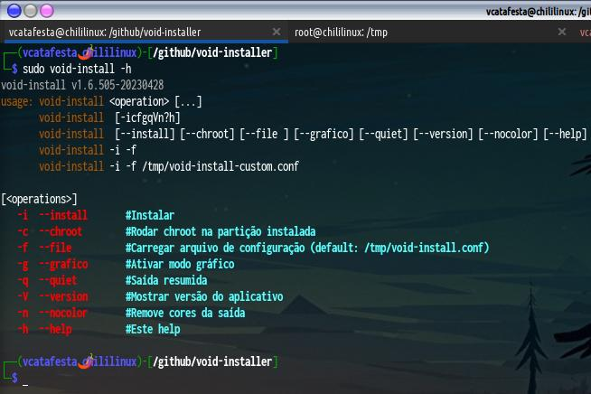

**Note:** `sudo` or escalated privileges are required to actually run the installer.

Run `void-install -i` to start the installer and choose language.

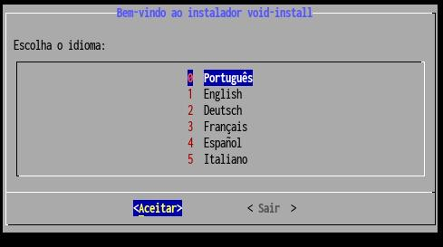
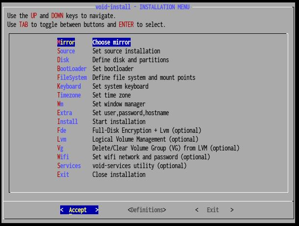
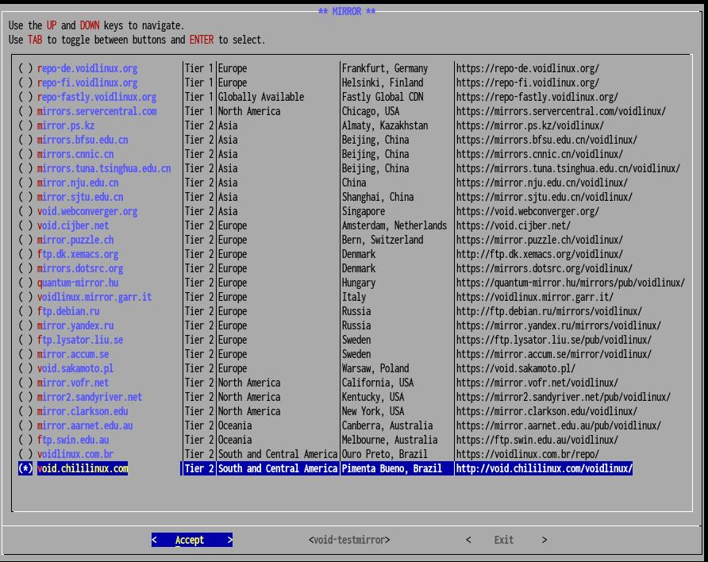
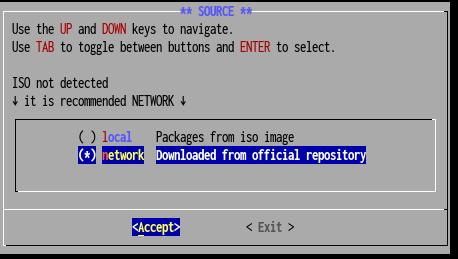
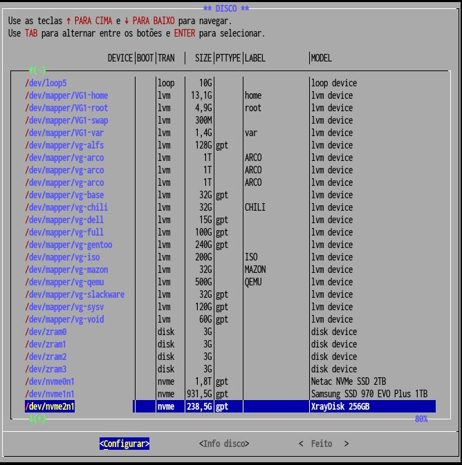
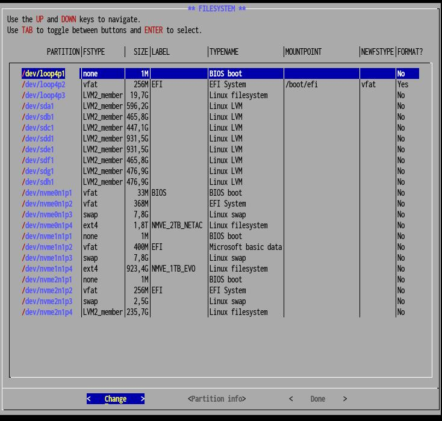
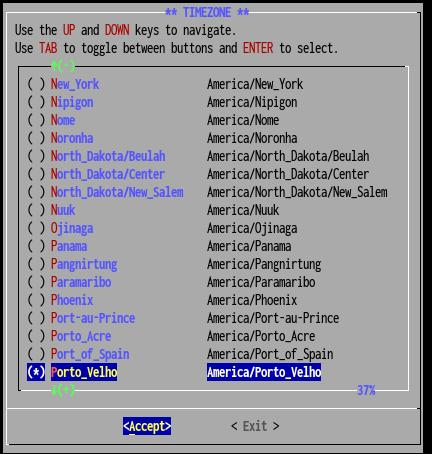
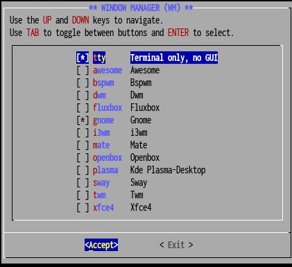
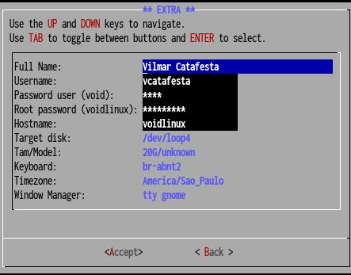
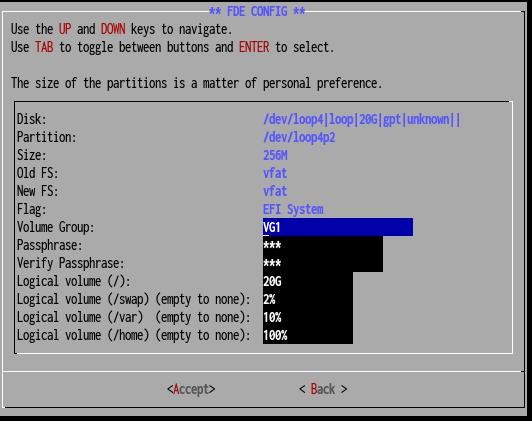
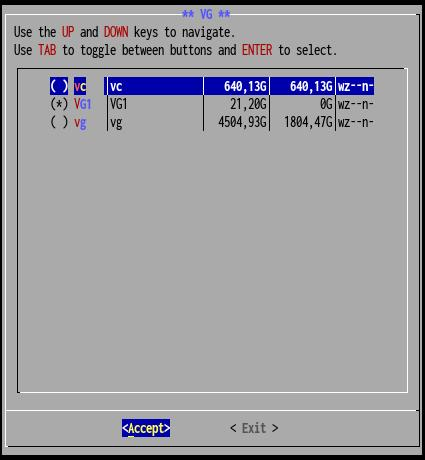
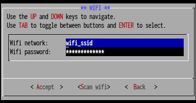
